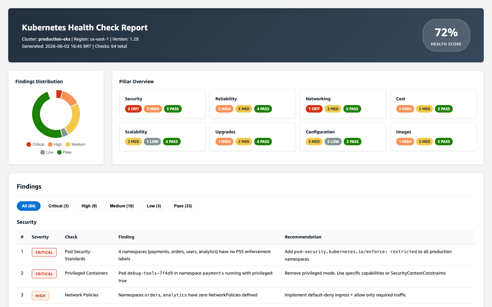
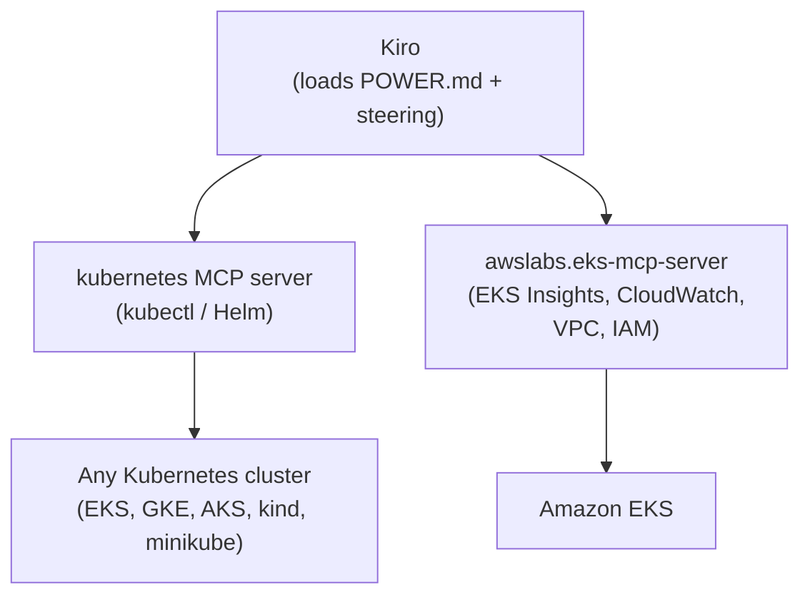

# Kubernetes Health Check - Kiro Power

A [Kiro Power](https://kiro.dev/docs/powers/) that turns Kiro into a Kubernetes and Amazon EKS reviewer. It inspects live cluster state through MCP tools and produces an actionable, severity-ranked report across eight best-practice pillars.

> Think of it as a pre-flight checklist for your cluster: run it before an upgrade, after an RBAC change, or on a monthly cadence to catch drift before it becomes an incident.

> Part of a broader collection of Kiro Skills, Powers and Steering at [brunokktro/KIRO](https://github.com/brunokktro/KIRO).

---

## What it does

When you ask Kiro to "run a health check on my cluster", this Power loads domain-specific guidance and executes read-only checks against your cluster, then categorizes every finding by severity (CRITICAL to INFO) with a concrete recommendation for each.

It covers **8 pillars**:

| Pillar | Examples of what it catches |
|--------|------------------------------|
| **Security** | Missing Pod Security Standards, privileged containers, `cluster-admin` bindings, secrets in env vars, namespaces with no NetworkPolicy |
| **Reliability** | Missing probes, no PodDisruptionBudgets, single-replica production deployments, naked pods, single-AZ data planes |
| **Networking** | VPC CNI tuning, IP exhaustion, CoreDNS scaling, `hostNetwork`/`hostPort` misuse, services with no endpoints |
| **Cost** | Over-provisioned requests, idle/orphaned PVCs, GP2 vs GP3, missing Karpenter consolidation, cross-AZ data transfer |
| **Upgrades** | Deprecated/removed APIs, version skew, add-on compatibility, EKS Insights, support lifecycle, webhook risks |
| **Configuration** | Missing semantic labels, workloads in `default` namespace, beta APIs in production, GitOps drift |
| **Image Build** | `:latest` tags, full-OS base images, no image scanning, running as root, public registry pulls |
| **Scalability** | API server load, etcd object count, node density vs IP limits, cluster service scaling, node diversity |

The guidance is grounded in official sources:
- [Kubernetes Configuration Good Practices](https://kubernetes.io/blog/2025/11/25/configuration-good-practices/)
- [Kubernetes Setup Best Practices](https://kubernetes.io/docs/setup/best-practices/)
- [Amazon EKS Best Practices Guide](https://docs.aws.amazon.com/eks/latest/best-practices/introduction.html)
- [AWS Well-Architected Container Build Lens](https://docs.aws.amazon.com/wellarchitected/latest/container-build-lens/container-build-lens.html)

### Example report

The health check produces an interactive HTML report with a health score, a findings donut chart, clickable pillar cards, severity-filtered tables, and a prioritized action list.



---

## How it works



- The **`kubernetes`** server runs every generic Kubernetes check (works on any cluster: EKS, GKE, AKS, kind, minikube).
- The **`awslabs.eks-mcp-server`** adds EKS-native depth: EKS Insights, CloudWatch metrics/logs, VPC/IP analysis, and IAM role audits.
- EKS checks are **skipped gracefully** when the cluster is not EKS or AWS credentials are absent.

---

## Installation

### Option A - Install from GitHub (recommended)

1. Open Kiro -> **Powers** panel.
2. Choose **Add power from GitHub**.
3. Paste the repository URL:
   ```text
   https://github.com/brunokktro/power-k8s-healthcheck
   ```
4. Kiro reads `POWER.md` and `mcp.json` and registers the two MCP servers.

### Option B - Install from local path (for development)

1. Clone this repository.
2. Open Kiro -> **Powers** panel -> **Add power from Local Path**.
3. Select the cloned directory.

---

## Prerequisites

| Tool | Required for | Verify |
|------|--------------|--------|
| `kubectl` + a reachable context | All checks | `kubectl config current-context` |
| `helm` (v3) | Helm/GitOps checks | `helm version` |
| `npx` (Node.js) | Runs the `kubernetes` MCP server | `npx --version` |
| `uvx` ([uv](https://docs.astral.sh/uv/)) | Runs the EKS MCP server | `uvx --version` |
| AWS CLI + credentials | EKS-specific checks only | `aws sts get-caller-identity` |

For EKS checks, the IAM principal needs read permissions (e.g. `eks:DescribeCluster`, `eks:ListInsights`, `cloudwatch:GetMetricData`, `logs:StartQuery`, `ec2:Describe*`, `iam:Get*`). See the [EKS MCP server README](https://github.com/awslabs/mcp/tree/main/src/eks-mcp-server) for the full read-only policy.

---

## Usage

After installation, just talk to Kiro using natural language. The Power activates on keywords like `kubernetes`, `eks`, `healthcheck`, `best practices`, `security`, `upgrade`, and `cost`.

| You say | What happens |
|---------|--------------|
| "Run a full health check on my EKS cluster `production` in `us-east-1`" | All 8 pillars, EKS checks enabled |
| "Check security best practices on my current context" | Security pillar only, any cluster |
| "Is my EKS cluster `staging` ready to upgrade from 1.29 to 1.30?" | Upgrade-readiness pillar + EKS Insights |
| "Find idle resources and right-sizing opportunities in namespace `production`" | Cost pillar, scoped to one namespace |
| "Validate YAML and labeling best practices across all namespaces" | Configuration pillar |

### Sample report shape

```text
## Summary
- Total checks: 42
- CRITICAL: 2 | HIGH: 7 | MEDIUM: 11 | LOW: 6 | PASS: 16

## Findings by Pillar

### Security
| # | Severity | Check                    | Finding                                  | Recommendation                          |
|---|----------|--------------------------|------------------------------------------|-----------------------------------------|
| 1 | CRITICAL | Pod Security Standards   | Namespace `payments` has no PSS labels   | Apply `enforce: restricted` label       |
| 2 | HIGH     | RBAC Least Privilege     | `ci-runner` bound to cluster-admin       | Scope to a namespaced Role              |

## Prioritized Actions
1. [CRITICAL] Enforce Pod Security Standards on `payments`
2. [HIGH] Replace cluster-admin binding for `ci-runner`
...
```

---

## Security posture

This Power is built for **read-only assessment**:

- `awslabs.eks-mcp-server` runs **without** `--allow-write`, so no mutating operations are possible. It uses `--allow-sensitive-data-access` only to read logs, events, and EKS Insights needed for the checks (this flag does not enable writes).
- `mcp-server-kubernetes` can be hardened to a strict non-destructive mode by adding an env var in `mcp.json`:

  ```json
  {
    "mcpServers": {
      "kubernetes": {
        "command": "npx",
        "args": ["-y", "mcp-server-kubernetes"],
        "env": { "ALLOW_ONLY_NON_DESTRUCTIVE_TOOLS": "true" }
      }
    }
  }
  ```

  Note: non-destructive mode disables `kubectl_generic` (used by a few checks such as `kubectl top` and `helm list`). The default config leaves it enabled for full check coverage; enable the strict mode if your policy requires it.

- Never pass secrets through the model. Use AWS Secrets Manager / Parameter Store and IRSA / EKS Pod Identity for workloads.

---

## Repository structure

```text
power-k8s-healthcheck/
|- POWER.md                       # Metadata, onboarding, workflow, steering map, license footer
|- mcp.json                       # MCP server configuration (kubernetes + EKS)
|- LICENSE                        # MIT
|- README.md                      # This file
|- assets/                        # Images used by the README
`- steering/                      # One file per pillar, loaded on demand
   |- security-checks.md
   |- reliability-checks.md
   |- networking-checks.md
   |- cost-checks.md
   |- upgrades-checks.md
   |- configuration-checks.md
   |- image-build-checks.md
   `- scalability-checks.md
```

---

## Limitations

- Image build checks are largely documentation-based guidance - full image scanning requires additional tooling (ECR enhanced scanning, Trivy, etc.).
- Cost checks rely on CloudWatch Container Insights being enabled for metric-based analysis.
- Some scalability thresholds are heuristics that depend on instance types and workload patterns.
- Network policy checks verify existence, not the correctness of the rules.
- PKI certificate expiry checks require exec access to nodes or control plane logs.

---

## Contributing

Issues and pull requests are welcome. Please open an issue describing the check you'd like to add or the false-positive you hit, and include the cluster type (EKS/other) and Kubernetes version.

---

## License and support

- **License:** [MIT](./LICENSE)
- **Integrated MCP servers:**
  - [mcp-server-kubernetes](https://github.com/Flux159/mcp-server-kubernetes) - MIT
  - [awslabs.eks-mcp-server](https://github.com/awslabs/mcp/tree/main/src/eks-mcp-server) - Apache-2.0
- **Privacy:** [AWS Privacy Notice](https://aws.amazon.com/privacy/) (for the EKS MCP server). The Kubernetes MCP server operates locally against your `kubectl` context.
- **Support:** [open an issue](https://github.com/brunokktro/power-k8s-healthcheck/issues)
